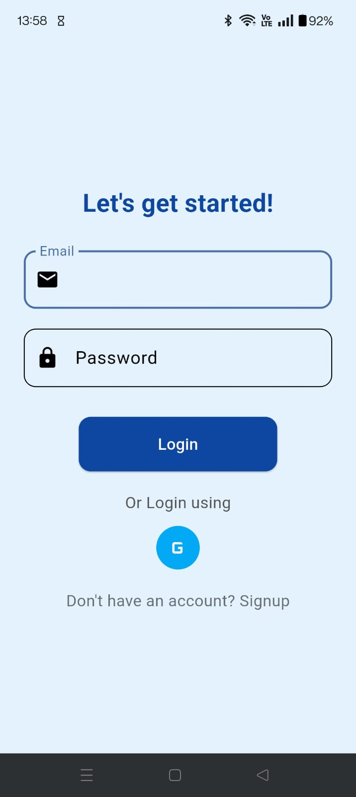

# 📱 MedSarthi — Your Personal Medicine Reminder Companion

MedSarthi is a Flutter-based mobile application designed to help users manage and track their medication schedules. It provides personalized reminders for medicine intake and offers helpful health tips, ensuring users never miss a dose.

---

## ✨ Features

- 🔒 **User Authentication**
  - Secure sign-up and login using **Firebase Authentication**.
  - Supports **Email/Password login** and **Google Sign-In**.

- 📋 **Medication Scheduling & Reminders**
  - Schedule medicine reminders with custom times.
  - Receive local notifications using **flutter_local_notifications**.
  - Actionable notifications with **'Taken'** and **'Reschedule'** options.
  - Reschedule medication directly from the notification or within the app.

- 🔔 **Local Notifications**
  - Custom notification sounds for reminders.
  - Android exact alarm support for precise notification delivery.

- 🗃️ **Database Management**
  - Stores user profiles and medication reminders using **Firebase Firestore**.
  - Tracks medicine intake progress and updates UI accordingly.

- 🎨 **Customizable Themes**
  - Toggle between **Light Mode** and **Dark Mode** using **Provider-based Theme Management**.

- 💡 **Health Tips**
  - Displays random daily health tips to promote good lifestyle habits.

---

## 📚 Tech Stack

| Technology        | Purpose                          |
|:----------------- |:--------------------------------|
| **Flutter**        | Front-end application development |
| **Dart**           | Programming language             |
| **Firebase Auth**  | User authentication              |
| **Firestore**      | Cloud-hosted NoSQL database       |
| **Flutter Local Notifications** | Local notification scheduling |
| **Provider**       | State management and theme control |

---

## 📱 Screenshots

| [](screenshots/add_new_reminder.jpg) <br> **Add New Reminder** | [](screenshots/login_page.jpg) <br> **Login Page** | [](screenshots/home_page.jpg) <br> **Home Page** | [](screenshots/notification_reminder.jpg) <br> **Notification Reminder** |
|:--:|:--:|:--:|:--:|

| [](screenshots/profile.jpg) <br> **Profile Page** | [](screenshots/taken.jpg) <br> **Taken State** | [](screenshots/dark_mode.jpg) <br> **Dark Mode** | [](screenshots/reshcedule_page.jpg) <br> **Reschedule Page** |
|:--:|:--:|:--:|:--:|


---

## 🚀 Getting Started

1. **Clone the repository**

```bash
git clone https://github.com/MokshadaSheth/MedSarthi
cd med_sarthi
````

2. **Install dependencies**

```bash
flutter pub get
```

3. **Run the app**

```bash
flutter run
```

4. **Build APK for release**

```bash
flutter build apk --release
```

The APK will be located at:

```
build/app/outputs/flutter-apk/app-release.apk
```

---

## 📖 Documentation & Resources

* [Flutter Documentation](https://docs.flutter.dev)
* [Firebase for Flutter](https://firebase.google.com/docs/flutter/setup)
* [flutter\_local\_notifications plugin](https://pub.dev/packages/flutter_local_notifications)
* [Provider package](https://pub.dev/packages/provider)

---

## 📌 Project Maintainer

**Mokshada Dinesh Sheth**
[GitHub Profile](https://github.com/MokshadaSheth)

---


